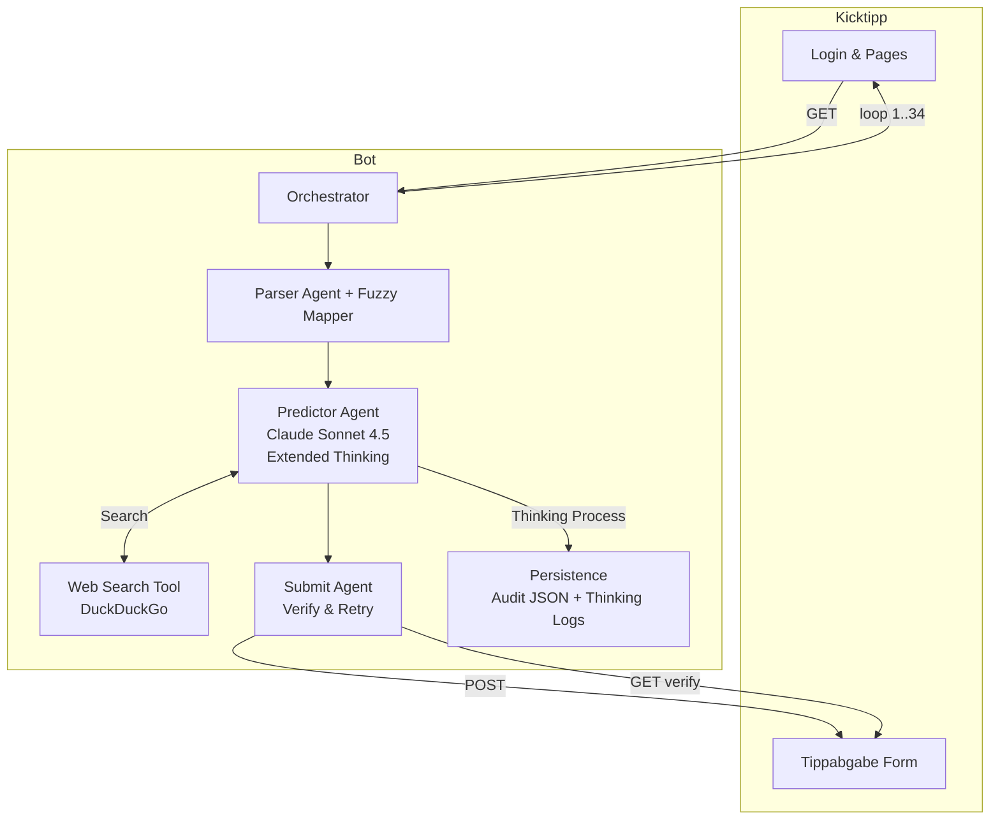

# Agents & Orchestration – Kicktipp Prediction Bot (Claude Edition)

This document describes the **agent-style architecture** using **Claude Sonnet 4.5** with **Extended Thinking Mode** for deep analytical reasoning and web search capabilities.

> **Goal:** *Reach first place in Kicktipp by maximizing prediction accuracy through advanced reasoning, live data, and statistical analysis.*

## TL;DR

- **Predictor Agent** uses **Claude Sonnet 4.5 with Extended Thinking** (10k token budget) + Web Search
- **Optimized Analysis Checklist** with natural conversation style (based on successful user tests)
- **Context-Aware Reasoning**: Derby situations, table positions, pressure scenarios, seasonal goals
- **Anti-Degeneration Guards**: Prevents monotonous patterns and unrealistic 1:1 series
- **Web Search Integration**: DuckDuckGo for live team news, injuries, form, odds
- **Parser/Submit Agents**: Identical to OpenAI version - scrape, map, post, verify with retry

## High-Level Architecture



## Agents (Detailed)

### 1. Orchestrator
- Controls matchday loop (1..34)
- Session management (cookies, CSRF)
- Error handling and logging
- Sequential processing per matchday

### 2. Parser Agent
**Unchanged from OpenAI version**
- Loads Tippabgabe HTML
- Extracts `tippsaisonId`, hidden fields
- Identifies input pairs (home/away goals)
- Fuzzy team name extraction
- Odds parsing (H/D/A)

### 3. Predictor Agent (Claude Sonnet 4.5)
**The core innovation of this version**

#### Extended Thinking Mode
```python
response = client.messages.create(
    model="claude-sonnet-4-5-20250929",
    max_tokens=16000,
    temperature=0.7,
    thinking={
        "type": "enabled",
        "budget_tokens": 10000  # Deep reasoning budget
    },
    messages=[...]
)
```

**Thinking Process:**
- Claude internally analyzes each match with up to 10k tokens
- Reasoning is logged separately from the final answer
- Enables chain-of-thought analysis without polluting output
- Example thinking: "Bayern has won 4/5 last games, Leipzig lost key defender Orban to injury, xG differential suggests 2+ goal margin..."

#### Optimized Analysis Checklist

The prompt uses a natural conversation style with clear guidelines:

**Key Factors to Consider:**
- **Aktuelle Tabellenposition** - Current league position and points
- **Form der letzten 5 Spiele** - Recent match results (wins/losses/goals)
- **Verletzte oder gesperrte Schlüsselspieler** - Injuries and suspensions (VERY IMPORTANT!)
- **Head-to-Head Bilanz** - Direct encounter history
- **Heimvorteil** - Home advantage (~0.4 goals difference statistically)
- **Besondere Umstände** - Special circumstances (Derby, European competition fatigue, coaching changes)

**Note:** This simplified approach was developed based on user feedback showing that natural conversation prompts produce more realistic results than rigid weighted methodologies.

#### Context Factors
Claude is explicitly prompted to consider:
- **Table position & seasonal goals** (title race, Europe spots, relegation battle)
- **Pressure situations** (must-win games)
- **Derby character** or rivalry intensity
- **Weather** (in extreme conditions)
- **Referee tendencies** (when relevant)

#### Diversification Strategies
- **Avoid monotonous patterns** (e.g., all home wins)
- **Realistic variance**: Mix of close and clear results
- **1:1 only with clear draw indication** (balanced teams + odds)
- **Goal calibration**: Bundesliga average ~2.8-3.0 goals/game

### 4. Web Search Tool
**Implementation:**
```python
def web_search_tool(query: str) -> str:
    """Uses DuckDuckGo (no API key needed)"""
    from duckduckgo_search import DDGS
    with DDGS() as ddgs:
        results = list(ddgs.text(query, max_results=5))
        return format_results(results)
```

**Typical Queries:**
- "Bayern München vs Leipzig injuries 2025"
- "RB Leipzig recent form Bundesliga"
- "Bayern München xG statistics 2024/25"
- "Bundesliga betting odds matchday 10"

Claude autonomously decides when to search based on prompt instructions.

### 5. Submit Agent
**Unchanged from OpenAI version**
- Fills form fields with predicted scores
- POSTs to Kicktipp
- Reloads page and verifies field values
- Retries once on mismatch

### 6. Persistence & Audit
**Enhanced for Claude:**
```json
{
  "thinking": [
    "Analyzing Bayern: 4W-1D last 5, xG 2.1...",
    "Leipzig injury: Orban out, defensive concern..."
  ],
  "response": "{\"predictions\": [...]}",
  "model": "claude-sonnet-4-5-20250929",
  "attempt": 1
}
```

Saved to `out/raw_claude/md{X}_claude_try{n}.json`

## Prompt Engineering for Excellence

### System Instructions (Natural Conversation)
Claude is given an **optimized, conversational prompt** that includes:
1. Clear task description: "Erstelle eine fundierte Prognose für den X. Bundesliga-Spieltag"
2. Research directive: "Recherchiere zunächst die aktuelle Tabelle, Form, Verletzungen und News"
3. Factor checklist: Natural list of considerations (not weighted percentages)
4. Guidelines: Diversification, calibration, realistic variance
5. Output format: Strict JSON schema

### User Prompt Structure
```
Erstelle eine fundierte Prognose für den X. Bundesliga-Spieltag mit präzisen Torvorhersagen.

**Wichtig:** Recherchiere zunächst die aktuelle Bundesliga-Tabelle, Form der Teams
(letzte 5 Spiele), Verletzungen und aktuelle News. Nutze diese Informationen für
realistische Prognosen.

**Zu analysierende Spiele:**
1. Bayern München vs Borussia Dortmund
   Quoten (H/D/A): 1.65 / 4.20 / 5.50
2. ...

**Für jedes Spiel berücksichtige:**
- Aktuelle Tabellenposition und Punktzahl beider Teams
- Form der letzten 5 Spiele (Siege/Niederlagen/Tore)
- Verletzte oder gesperrte Schlüsselspieler (SEHR WICHTIG!)
- Head-to-Head Bilanz
- Heimvorteil (statistisch ~0.4 Tore Unterschied)
- Besondere Umstände (Derby, Europacup-Belastung, Trainerwechsel)

**Realistische Ergebnisse erstellen:**
- Bundesliga-Durchschnitt: ~2.8 Tore pro Spiel
- Variation ist wichtig: Mix aus 2:1, 3:1, 1:0, 2:2, etc.
- Vermeide monotone Muster (nicht alle 2:1 oder alle Heimsiege)
- 1:1 nur wenn beide Teams wirklich ausgeglichen sind
- Mutige, aber fundierte Tipps für Spitzenplatzierung

**Ausgabeformat (JSON):**
[JSON schema with example]

Erstelle N Predictions für die oben gelisteten Spiele (row_index 1 bis N).
Teamnamen EXAKT wie oben angegeben verwenden!
```

### Why This Prompt Works

1. **Natural Conversation**: More like asking an expert than following a rigid template
2. **Clear Priorities**: VERY IMPORTANT markers highlight critical factors (injuries)
3. **Diversification Mandate**: Avoids degenerate patterns naturally
4. **Live Data Requirement**: Explicit research directive
5. **Clear Output Format**: Ensures parseable JSON every time
6. **Based on Real Feedback**: Developed from user tests showing more realistic results

## Validation & Anti-Degeneration

### Validation Rules
```python
def validate_predictions(preds: List[Dict], rows: List[Row], matchday: int,
                         forbid_degenerate: bool = True) -> List[Dict]:
```

**Checks:**
- Exactly N predictions (9 for Bundesliga)
- Correct `row_index` sequence (1..9)
- Integer goals (0-9)
- No duplicate indices
- **Degeneration check**: Max 3 draws (or <50% of matches)

**Failure Actions:**
- Retry with modified prompt (add "avoid series of same results")
- Log warning
- After max retries: raise error

### Anti-Degeneration in Prompt
The prompt explicitly instructs:
```
- VERMEIDE monotone Muster (z.B. alle Heimsiege)
- 1:1 NUR bei echter Remis-Indikation
- Realistische Varianz: Mix aus knappen und deutlichen Ergebnissen
- Beachte: Hohe Trefferquote durch mutige, aber fundierte Prognosen
```

## Configuration

### Key Parameters

| Parameter | Default | Description |
|-----------|---------|-------------|
| `model` | `claude-sonnet-4-5-20250929` | Latest Claude Sonnet 4.5 |
| `temperature` | `0.7` | Balance creativity/consistency |
| `max_tokens` | `16000` | Output limit |
| `thinking.budget_tokens` | `10000` | Extended thinking budget |
| `timeout` | `180s` | API timeout |
| `max_retries` | `3` | Retry on validation failure |

### Config File
```ini
[anthropic]
api_key = sk-ant-...
model = claude-sonnet-4-5-20250929
temperature = 0.7
timeout = 180
max_retries = 3
```

## Observability & Logs

### Sample Log Output
```
2025-10-17 14:23:15 | INFO | Claude[sonnet-4.5] call: model=claude-sonnet-4-5-20250929, md=10, matches=9, try=1
2025-10-17 14:23:18 | INFO | [Claude Thinking] Analyzing Bayern München: Won 4/5 recent games, xG 2.3...
2025-10-17 14:23:45 | INFO | Claude predictions validated successfully: 9 items
2025-10-17 14:23:45 | INFO | [Predictions] Spieltag 10: 9 Vorhersagen gespeichert → out/predictions/...
2025-10-17 14:23:50 | INFO | [Submit] Spieltag 10: 9/9 Spiele gespeichert.
```

### Artifacts to Inspect

1. **Thinking Process**: `out/raw_claude/md10_claude_try1.json`
   ```json
   {
     "thinking": [
       "Bayern analysis: Strong home form, 12 goals in 3 home games...",
       "Leipzig concern: Orban injury weakens defense, conceded in 4/5..."
     ],
     "response": "{\"predictions\": [...]}"
   }
   ```

2. **Final Predictions**: `out/predictions/4001464_md10.json`
   ```json
   [
     {
       "row_index": 1,
       "matchday": 10,
       "home_team": "FC Bayern München",
       "away_team": "RB Leipzig",
       "predicted_home_goals": 3,
       "predicted_away_goals": 1,
       "reason": "Form+Heimvorteil+Orban-Ausfall. xG-Diff 0.9. Odds 1.65."
     }
   ]
   ```

## Comparison: Claude vs OpenAI Architecture

| Aspect | Claude Sonnet 4.5 | OpenAI GPT-5 |
|--------|-------------------|--------------|
| **Reasoning Mode** | Extended Thinking (optional) | Implicit chain-of-thought |
| **Thinking Budget** | 10k tokens (when enabled) | Hidden |
| **Web Search** | DuckDuckGo (external) | Built-in tool |
| **Prompt Style** | Natural conversation with checklist | Standard research prompt |
| **Default Temperature** | 0.7 (1.0 when Extended Thinking) | 0.4 |
| **Validation** | Same (strict schema) | Same |
| **Submit Logic** | Identical | Identical |
| **Audit Logs** | Includes thinking process (if enabled) | Text-only responses |

## Extending the System

### 1. Custom Data Sources
```python
def web_search_tool(query: str) -> str:
    # Add custom sources
    if "injuries" in query:
        return fetch_from_transfermarkt(query)
    elif "xG" in query:
        return fetch_from_understat(query)
    else:
        return ddg_search(query)
```

### 2. Fine-Tune Factor Priorities
Edit `build_prompt_claude_advanced()`:
```python
# Emphasize specific factors more
lines.append("**Für jedes Spiel berücksichtige:**")
lines.append("- Verletzte oder gesperrte Schlüsselspieler (HÖCHSTE PRIORITÄT!)")  # Emphasized
lines.append("- Form der letzten 5 Spiele (Siege/Niederlagen/Tore)")
lines.append("- Aktuelle Tabellenposition und Punktzahl beider Teams")
# ... rest
```

### 3. Ensemble Predictions
Run both Claude and OpenAI, average results:
```python
claude_preds = call_claude_predictions(...)
openai_preds = call_openai_predictions(...)
final_preds = ensemble_average(claude_preds, openai_preds)
```

### 4. Historical Learning
Store past predictions + actual results:
```python
def add_historical_context(prompt: str, matchday: int) -> str:
    history = load_past_matchdays(matchday - 5, matchday - 1)
    accuracy = calculate_accuracy(history)
    return prompt + f"\n\nHistorische Genauigkeit: {accuracy}..."
```

## Failure Modes & Fixes

| Symptom | Cause | Fix |
|---------|-------|-----|
| `Anthropic SDK nicht verfügbar` | Missing dependency | `pip install anthropic>=0.39.0` |
| `Web search failed` | DuckDuckGo issue | `pip install duckduckgo-search>=7.0.0` |
| Too many 1:1 results | Degenerate output | Increase temperature to 0.8, add prompt hint |
| Slow responses | Extended thinking overhead | Reduce `thinking.budget_tokens` to 5000 |
| API timeout | Complex matchday | Increase `timeout` to 240s |
| Validation errors | Malformed JSON | Check `raw_claude/*.json`, retry with clearer format instructions |

## Performance Tuning

### For Maximum Accuracy:
```python
temperature = 0.7          # Balanced
thinking_budget = 10000    # Full analysis
timeout = 180              # Patient
max_retries = 3            # Robust
```

### For Speed:
```python
temperature = 0.5          # More deterministic
thinking_budget = 5000     # Faster reasoning
timeout = 120              # Quicker cutoff
max_retries = 2
```

### For Cost Optimization:
```python
model = "claude-sonnet-4-20250514"  # Slightly older, cheaper
thinking_budget = 3000              # Minimal thinking
```

## Security & Best Practices

1. **API Keys**: Store in environment variables or `config.ini` (gitignored)
2. **Rate Limiting**: Built-in via `timeout` and sequential processing
3. **Error Handling**: All API calls wrapped in try-except with retries
4. **Audit Trail**: All raw responses saved for debugging
5. **No PII**: Only team names and scores processed

## FAQ

**Q: How does Extended Thinking improve accuracy?**
A: Claude can "think out loud" internally before answering, analyzing multiple factors sequentially without cluttering the final output.

**Q: Can I see the thinking process?**
A: Yes! Check `out/raw_claude/md{X}_claude_try{n}.json` → `"thinking"` field.

**Q: Is web search automatic?**
A: Yes, but Claude decides when to search based on prompt instructions. The prompt explicitly says "Nutze JETZT Live-Daten (Web-Recherche) für JEDES Spiel!"

**Q: How do I improve predictions further?**
A:
1. Add more specific data sources (Transfermarkt API, Understat)
2. Tune factor weightings based on your league
3. Increase thinking budget to 15k tokens
4. Run ensemble with OpenAI for consensus

**Q: What if Claude gives unrealistic scores (e.g., 7:0)?**
A: The prompt includes calibration rules ("Bundesliga-Durchschnitt: ~2.8-3.0 Tore/Spiel"), but you can add explicit caps in validation:
```python
if hg + ag > 6:  # Total goals exceeds 6
    raise ValueError("Unrealistic total goals")
```

## Roadmap

- [ ] **Ensemble Mode**: Combine Claude + OpenAI predictions
- [ ] **Historical Learning**: Use past accuracy to adjust weightings
- [ ] **Live Odds Integration**: API for real-time odds (bet365, pinnacle)
- [ ] **Multi-League Support**: Expand beyond Bundesliga
- [ ] **A/B Testing**: Compare prompt variations systematically
- [ ] **Automated Tuning**: ML-based weight optimization

## Conclusion

This Claude Sonnet 4.5 edition represents the **state-of-the-art** in AI-powered football predictions for Kicktipp. By combining:
- Advanced reasoning (Extended Thinking, optional)
- Live data (Web Search)
- Natural, focused prompts (based on successful user tests)
- Context awareness (Derby, pressure, table position)
- Optimized defaults (Extended Thinking off, Temperature 0.7)

...the system is designed to maximize accuracy with realistic, varied predictions and **reach first place**. 🏆

For support, check logs in `out/raw_claude/` and validate your `config.ini`.
